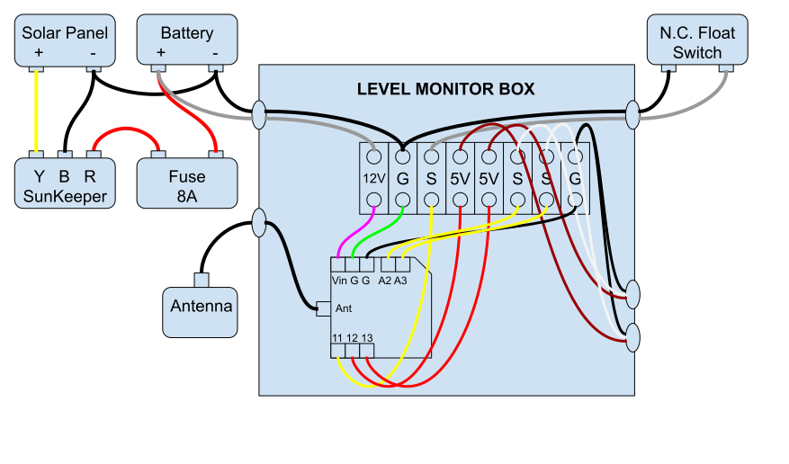

# Arduino SMS Tank Alarm

Arduino LTE cellular system that monitors tank levels and sends SMS alerts when thresholds are exceeded. Includes both client (tank monitoring) and server (data aggregation) components.

Arduino will check sensor data on a scheduled basis. If sensor data is over a set threshold, the arduino will send an SMS text message to defined phone numbers. It will also send a daily reading of the sensor data at a set time of day.

## Version 112025 (Blues Wireless + Arduino Opta)

The 112025 version uses Arduino Opta with Blues Wireless Notecard for cellular connectivity. Features include:
- **Internal flash storage** (LittleFS) - No SD card required
- **Fleet-based communication** - Simplified device-to-device data exchange via Blues Notehub
- **Web-based configuration** - Update clients remotely from server dashboard
- **Intranet dashboard** - Real-time monitoring via Ethernet web interface

### 📊 Setup Presentation
- **[PowerPoint Setup Guide](TankAlarm_112025_Setup_Guide.pptx)** - Comprehensive visual guide with screenshots
  - Hardware wiring diagrams
  - Step-by-step software installation
  - Blues Notehub configuration
  - Web interface tutorials
  - See [PRESENTATION_README.md](PRESENTATION_README.md) for details

### Quick Links - 112025 Client (Tank Monitor)
- **[Installation Guide](TankAlarm-112025-Client-BluesOpta/INSTALLATION.md)** - Complete Arduino IDE setup with library installation
- **[Fleet Implementation Summary](TankAlarm-112025-Client-BluesOpta/FLEET_IMPLEMENTATION_SUMMARY.md)** - Architecture overview
- **[Migration Guide](TankAlarm-112025-Client-BluesOpta/MIGRATION_GUIDE.md)** - Upgrading from route-based setup

### Quick Links - 112025 Server (Data Aggregation)
- **[Installation Guide](TankAlarm-112025-Server-BluesOpta/INSTALLATION.md)** - Complete Arduino IDE setup with library installation
- **[Fleet Setup Guide](TankAlarm-112025-Server-BluesOpta/FLEET_SETUP.md)** - Blues Notehub fleet configuration

### Configuration Approach (112025)

The 112025 version uses a **simplified configuration system**:

1. **LittleFS Internal Storage** - Configuration persisted to device flash
   - No SD card required
   - Survives power cycles
   - Automatic default config on first boot
   
2. **Remote Configuration** - Update clients via server web interface
   - Push config changes from server to any client
   - Changes routed through Blues Notehub
   - No physical access needed for updates

3. **Fleet-Based Communication** - Simplified device-to-device routing
   - Just assign devices to fleets in Blues Notehub
   - No manual route configuration needed
   - Easier scaling for multiple devices

## Version 092025 (Current - Recommended for MKR NB 1500)

The 092025 version is the latest implementation using Arduino MKR NB 1500 with Hologram.io cellular connectivity.

### Quick Links - Client (Tank Monitor)
- **[Client README](TankAlarm-092025-Client-Hologram/README.md)** - Full documentation
- **[Installation Guide](TankAlarm-092025-Client-Hologram/INSTALLATION.md)** - Step-by-step setup
- **Configuration Files:**
  - [`tank_config.txt`](TankAlarm-092025-Client-Hologram/tank_config.txt) - SD card configuration template
  - [`config_template.h`](TankAlarm-092025-Client-Hologram/config_template.h) - Hardware constants
  - [`calibration.txt`](TankAlarm-092025-Client-Hologram/calibration.txt) - Calibration template

### Quick Links - Server (Data Aggregation)
- **[Server README](TankAlarm-092025-Server-Hologram/README.md)** - Full documentation
- **[Installation Guide](TankAlarm-092025-Server-Hologram/INSTALLATION.md)** - Step-by-step setup
- **Configuration Files:**
  - [`server_config.txt`](TankAlarm-092025-Server-Hologram/server_config.txt) - SD card configuration template
  - [`server_config.h`](TankAlarm-092025-Server-Hologram/server_config.h) - Hardware constants

### Configuration Approach (Streamlined for 092025)

Both client and server use a **two-file configuration system**:

1. **SD Card Configuration (.txt files)** - User settings stored on SD card
   - Easy field updates without recompiling
   - Contains device keys, phone numbers, thresholds, network settings
   - **REQUIRED** - devices will not start without valid SD card config

2. **Hardware Configuration (.h files)** - Compile-time constants
   - Pin assignments, sensor types, buffer sizes
   - Already configured with sensible defaults
   - Only modify if customizing hardware

This approach keeps setup simple and consistent between client and server.

# General Logic

	
	Read sensor
		
		If over X
		
			Connect to Network
			
				Text #1 - Data Logger
			
				Text #2 - Emergency contact
				
				Text #3 - Emergency contact
				
			Disconnect
			
			Sleep 1Hr
			
		If under X
		
			If time = 5-6AM
			
				Connect to Network
				
					Text #1 - Data Logger
				
				Disconnect
			
				Sleep 1Hr
				
			If time =/= 5-6AM
			
				Sleep 1Hr

# Bill of Materials

<a href="https://github.com/dorkmo/ArduinoSMSTankAlarm/blob/master/BillOfMaterials.md">Bill Of Materials</a>

## Hardware Compatibility

For questions about SD card shield compatibility between MKR SD PROTO and MKR ETH shields, see:
[SD Card Shield Compatibility Guide](SD_CARD_SHIELD_COMPATIBILITY.md)

## Wiring Diagram

# Links - Arduino

http://www.arduino.org/learning/getting-started/getting-started-with-arduino-gsm-shield-2

http://www.arduino.org/learning/tutorials/ide-examples

https://github.com/arduino-org/Arduino/tree/master/hardware/arduino/avr/libraries/GSM

http://www.arduino.org/learning/tutorials/advanced-guides/how-to-use-the-arduino-gsm-shield-with-arduino-leonardo-arduino-yun-and-arduino-mega

http://www.arduino.org/learning/reference/GSM

http://www.arduino.org/learning/tutorials/boards-tutorials/play-with-force-sensor-example

http://www.arduino.org/learning/tutorials/boards-tutorials/gsm-shield-2-voice-call-example

http://www.arduino.org/learning/reference/gsm-constructor

http://www.arduino.org/learning/reference/std-standby

http://www.arduino.org/learning/reference/begin-mode

http://playground.arduino.cc/Learning/arduinoSleepCode

https://www.arduino.cc/en/Tutorial/Files

https://www.arduino.cc/en/Hacking/BuildProcess

https://www.arduino.cc/en/Guide/Environment

https://create.arduino.cc/projecthub/feilipu/battery-powered-arduino-applications-through-freertos-3b7401

https://www.arduino.cc/en/Reference/GSMSMSRead

https://www.arduino.cc/en/Reference/Char

https://www.arduino.cc/en/Reference/Array

https://www.arduino.cc/en/Tutorial/GSMExamplesReceiveSMS

https://forum.arduino.cc/index.php?topic=163636.0

*Sparkfun LTE-M Shield*

https://www.sparkfun.com/products/14997

https://learn.sparkfun.com/tutorials/lte-cat-m1nb-iot-shield-hookup-guide

# Links - Digi Xbee

Sleep

https://www.digi.com/resources/documentation/Digidocs/90002258/#Reference/r_cmd_D8.htm

SMS

https://www.digi.com/resources/documentation/Digidocs/90002258/Reference/r_cmd_IP.htm

https://www.digi.com/resources/documentation/digidocs/pdfs/90001543.pdf - pinout Page 29

https://www.digi.com/resources/documentation/Digidocs/90002258/Reference/r_cmd_Ppound.htm?tocpath=AT%20commands%7CAddressing%20commands%7C_____4

https://www.u-blox.com/sites/default/files/SARA-R4-SARA-N4_ATCommands_(UBX-17003787).pdf - Page 67

http://blockly.parallax.com/blockly/projectlink?id=7440&key=b787f9fa-7904-460e-bbff-f64d93a3c7e6#

https://hologram.io/docs/reference/cloud/embedded/

AT Commands

https://electronics.stackexchange.com/questions/33421/how-to-call-at-command-on-xbee-from-arduino

https://forum.arduino.cc/index.php?topic=61238.0

https://www.instructables.com/id/Digi-XBee3-Cellular-SMS-ActivityBot/
https://www.digi.com/resources/documentation/Digidocs/90002258/#Reference/r_cmd_IP.htm%3FTocPath%3DAT%2520commands%7CNetwork%2520commands%7C_____1

https://www.digi.com/resources/documentation/digidocs/90002253/default.htm#Reference/r_cmd_Ppound.htm%3FTocPath%3DAT%2520commands%7CAddressing%2520commands%7C_____4

https://itp.nyu.edu/classes/towers-spring2014/labs-how-to/send-sms-with-at-commands/

# Links - Cellular Service

https://marketplace.att.com/products/att-iot-dataplans-lte-m-us

https://hologram.io/
