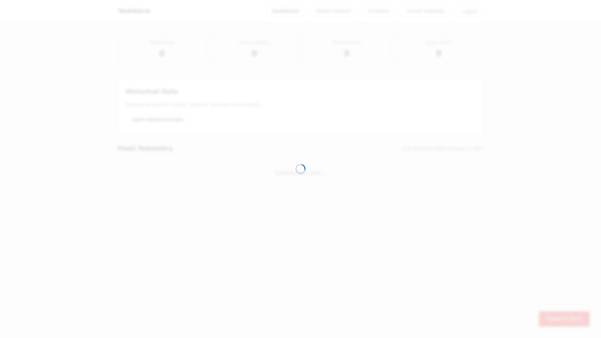
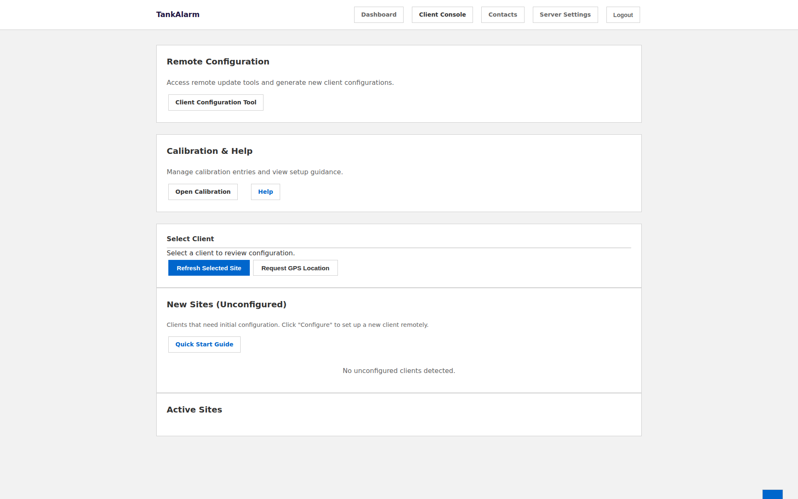
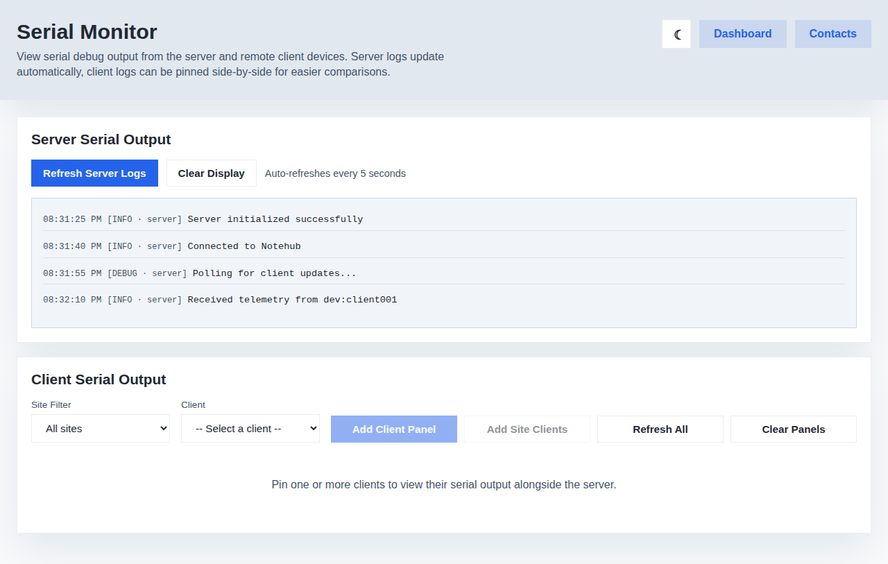
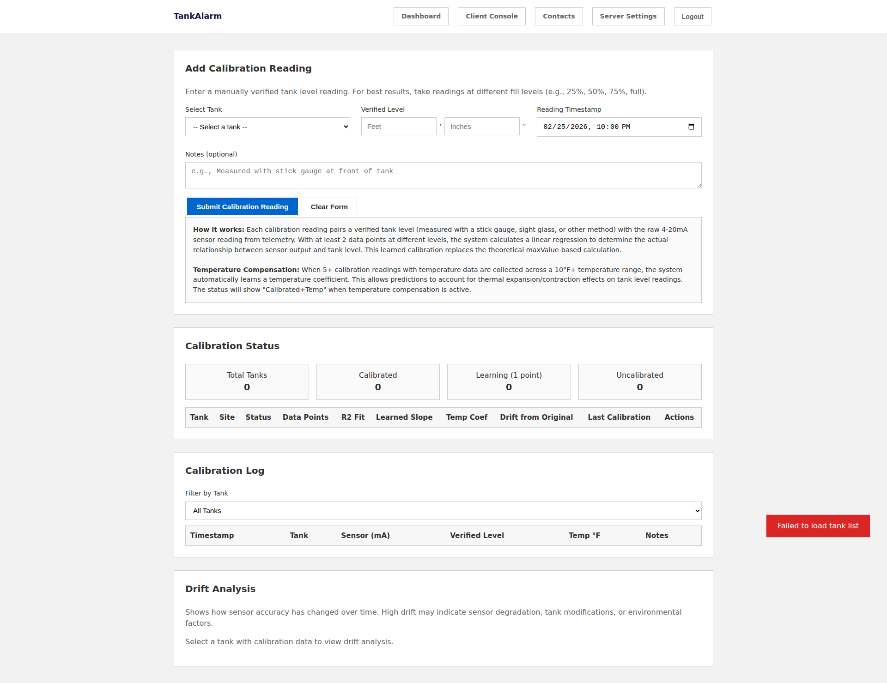
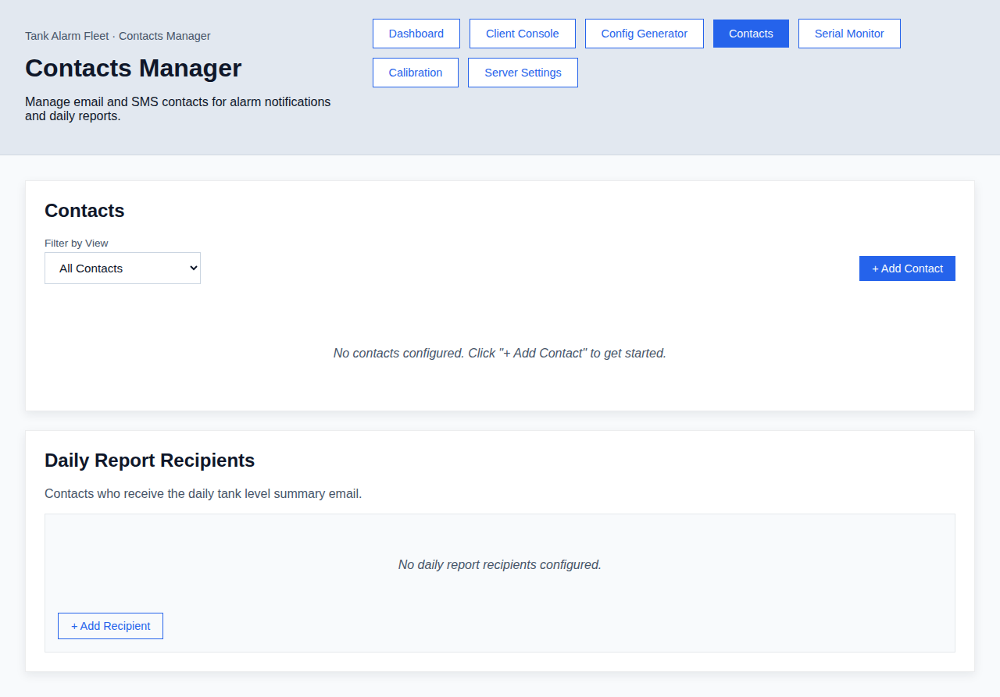
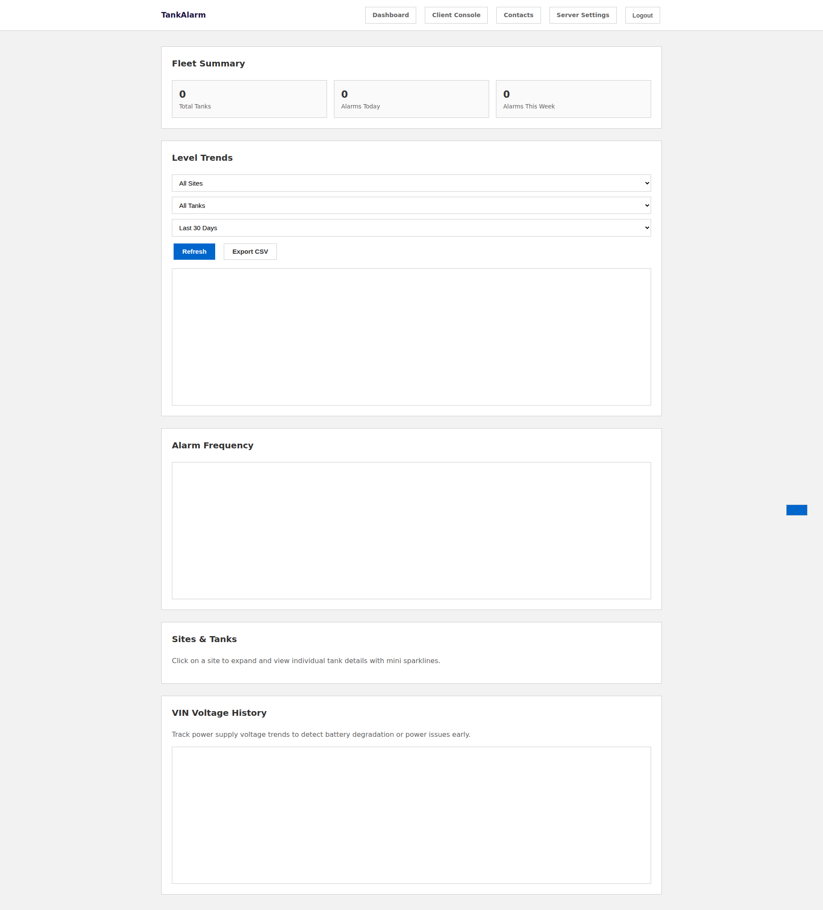

# Website Preview - TankAlarm 112025 Server

This document contains screenshots of the web interface served by the TankAlarm-112025-Server-BluesOpta.

## Dashboard
Main fleet telemetry dashboard showing server metadata, statistics, and fleet telemetry table with relay controls.

## Client Console
Configuration management interface for remote clients with PIN-protected controls (unlocked view).

## Config Generator
Create new client configurations with sensor definitions and alarm thresholds.

## Serial Monitor
Debug log viewer with server and client serial output.

## Calibration
Calibration learning system with manual level reading submission and drift analysis.

## Contacts Manager
Contact and notification management with alarm associations.

## Server Settings
Server-wide configuration including FTP backup, network settings, and daily email schedule.

## Historical Data
Historical trends, charts, and analytics for tank fleet with level trends, alarm frequency, and site/tank details.

---
*Screenshots automatically generated by GitHub Actions*  
*Last updated: 2026-02-13 17:28:27 UTC*
