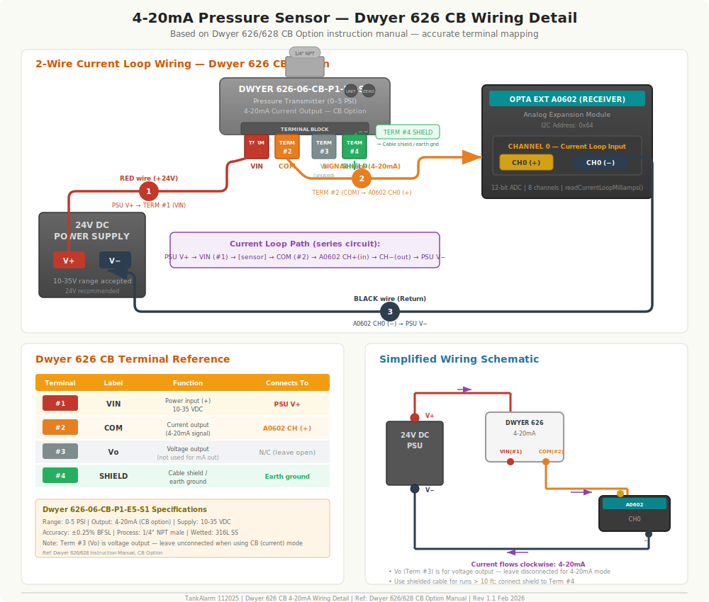

# TankAlarm 112025 Client - Wiring Diagram & Hardware Connection Guide

**Version:** 1.0.0  
**Last Updated:** February 6, 2026  
**Platform:** Arduino Opta Lite + Blues Wireless for Opta + Opta Ext A0602

---

## Wiring Diagrams (SVG Images)

The following SVG diagrams are available in the `images/` folder:

1. **[System Overview](images/wiring-01-system-overview.svg)** — Complete system showing Opta, Blues Notecard, A0602 expansion, sensors, and relay outputs
2. **[4-20mA Sensor Wiring](images/wiring-02-4-20ma-sensor.svg)** — Detailed Dwyer 626 CB terminal wiring with current loop schematic
3. **[Digital Inputs & Relay Outputs](images/wiring-03-digital-relay.svg)** — Float switch, Hall effect RPM, and relay output wiring details
4. **[Hardware Lineup](images/wiring-04-hardware-lineup.svg)** — All three boards side-by-side: Opta Lite, Blues Wireless for Opta, and A0602 expansion

---

## System Architecture Overview


```
┌─────────────────────────────────────────────────────────────────────┐
│                      12-24V DC Power Supply                        │
│                   (DIN Rail Mount Recommended)                     │
└──────────────────────────┬──────────────────────────────────────────┘
                           │ V+ / GND
                           ▼
┌──────────────────────────────────────────────────────────────────────┐
│                      ARDUINO OPTA LITE (AFX00003)                   │
│                    STM32H747XI Dual-Core Processor                  │
│                                                                      │
│  ┌──────────────┐  ┌───────────────────┐  ┌──────────────────────┐  │
│  │ Digital Inputs│  │   Relay Outputs   │  │    I2C Bus (Wire)    │  │
│  │  I1-I8 (8x)  │  │   D0-D3 (4x)     │  │  SDA / SCL           │  │
│  │  Float Switch │  │   LED_D0-LED_D3   │  │  400 kHz             │  │
│  │  Hall Effect  │  │   Pump/Valve Ctrl │  │                      │  │
│  └──────┬───────┘  └───────┬───────────┘  └──────┬──┬────────────┘  │
│         │                  │                     │  │                │
│         │                  │              ┌──────┘  └──────┐        │
│         │                  │              ▼                ▼        │
│         │                  │     ┌──────────────┐  ┌────────────┐   │
│         │                  │     │ Blues Notecard │  │ Opta Ext   │   │
│         │                  │     │ I2C: 0x17     │  │ A0602      │   │
│         │                  │     │ Cellular+GPS  │  │ I2C: 0x64  │   │
│         │                  │     └──────────────┘  └────────────┘   │
└─────────┼──────────────────┼────────────────────────────────────────┘
          │                  │
    To Sensors         To Pumps/Valves
```

---

## 1. Power Supply

### Main Power Input (Arduino Opta)

| Parameter | Value |
|-----------|-------|
| **Input Voltage** | 12-24V DC |
| **Recommended** | 24V DC, DIN rail mount supply |
| **Current** | 500mA minimum recommended |
| **Connector** | Screw terminal on Opta |
| **Operating Temperature** | -20°C to +50°C |
| **Fuse** | 2A recommended |
| **Wire Gauge** | 18-22 AWG |

### Wiring

```
    24V DC Power Supply
    ┌─────────────────┐
    │  V+ ──────────────────► Opta V+ (Power Terminal)
    │  GND ─────────────────► Opta GND (Power Terminal)
    └─────────────────┘
```

### Optional: Solar Power System

For remote solar installations:

```
    Solar Panel (12V, 50-100W)
         │
         ▼
    ┌───────────────────────────┐
    │  SunKeeper-6 / SunSaver   │
    │  Solar Charge Controller   │
    │  ┌─────────────────────┐  │
    │  │ Solar In  │ Load Out │  │
    │  └─────────────────────┘  │
    │  │ Battery Terminals    │  │
    └──┼──────────────────────┘
       │
       ▼
    ┌──────────────┐        ┌──────────────────┐
    │ 12V Battery  │───────►│  DC-DC Converter  │──► 24V to Opta
    │ (Optima D31T)│        │  12V→24V (opt.)   │
    └──────────────┘        └──────────────────┘
```

> **Note:** The Opta accepts 12-24V DC, so a 12V battery can power it directly without a DC-DC converter. Use 24V only if sensor loop power requires it.

---

## 2. Blues Wireless Notecard (Cellular + GPS)

### Connection Method

The Blues Notecard connects via the **Blues Wireless for Opta** carrier board, which plugs directly into the Arduino Opta's expansion connector. No wiring needed — it's a plug-in module.

| Parameter | Value |
|-----------|-------|
| **Carrier Board** | Blues Wireless for Opta |
| **Interface** | I2C (shared bus with Opta Ext) |
| **I2C Address** | `0x17` |
| **I2C Frequency** | 400 kHz |
| **Notecard Model** | NOTE-NBGL (North America LTE-M/NB-IoT) |
| **Power** | Powered by Opta via carrier board |
| **Antenna** | Included cellular antenna (must be attached) |

### Code Initialization

```cpp
// From TankAlarm_Common.h
#define NOTECARD_I2C_ADDRESS    0x17
#define NOTECARD_I2C_FREQUENCY  400000UL  // 400 kHz

// In setup()
Wire.begin();
Wire.setClock(NOTECARD_I2C_FREQUENCY);
notecard.begin(NOTECARD_I2C_ADDRESS);
```

### Physical Installation

```
    ┌─────────────────────────────────────┐
    │          Arduino Opta Lite          │
    │                                     │
    │  ┌─────────────────────────────┐    │
    │  │    Blues Wireless for Opta   │    │
    │  │    (Carrier Board)          │    │
    │  │  ┌───────────────────────┐  │    │
    │  │  │   Blues Notecard      │  │    │
    │  │  │   NOTE-NBGL-500      │  │    │
    │  │  │   ┌─────────┐        │  │    │
    │  │  │   │ SIM Card │        │  │    │
    │  │  │   └─────────┘        │  │    │
    │  │  └──────────┬────────────┘  │    │
    │  │    Cellular Antenna ──────────►  │
    │  └─────────────────────────────┘    │
    │     (Plugs into Opta connector)     │
    └─────────────────────────────────────┘
```

### Optional: Battery Voltage Monitoring via Notecard

When the Notecard is wired directly to a 12V battery (via the Notecard VIN pin), it can report battery voltage without additional sensors.

```
    12V Battery ── V+ ──► Notecard VIN (3.8V-17V supported)
                   GND ──► Notecard GND
```

> **Tip:** Add a Schottky diode on V+ for reverse polarity protection.

---

## 3. Arduino Opta Ext A0602 — Analog Expansion Module

### Connection Method

The Opta Ext A0602 connects to the Arduino Opta via the **proprietary expansion connector** (daisy-chain bus). It does NOT use separate I2C or SPI wiring — it snaps onto the Opta's side expansion port.

| Parameter | Value |
|-----------|-------|
| **Part Number** | AFX00007 |
| **Interface to Opta** | Expansion connector (proprietary daisy-chain bus) |
| **I2C Address** | `0x64` (for 4-20mA current loop readings via I2C) |
| **Analog Inputs** | 8 channels (CH0-CH7) |
| **Input Types** | 0-10V voltage OR 4-20mA current loop (per-channel configurable) |
| **ADC Resolution** | 12-bit (0-4095) |
| **Power** | Powered by Opta via expansion connector |

### Physical Connection

```
    ┌─────────────────┐    Expansion    ┌──────────────────────┐
    │  Arduino Opta   │◄──Connector───►│  Opta Ext A0602      │
    │  Lite           │   (snap-on)     │  Analog Expansion    │
    │                 │                 │                      │
    │  I2C Bus ───────┼────────────────►│  CH0-CH7 Inputs      │
    │  (SDA/SCL)      │                 │  (0-10V / 4-20mA)    │
    └─────────────────┘                 └──────────────────────┘
```

### How the A0602 Communicates

- **Analog Voltage Sensors (0-10V):** Read via `analogRead(channel)` — the expansion maps channels through the Arduino analog API
- **4-20mA Current Loop Sensors:** Read via **I2C** at address `0x64` — the firmware sends the channel number and reads back a 16-bit raw value

---

## 4. Sensor Connections — 4-20mA Current Loop



### How 4-20mA Sensors Are Read

The 4-20mA current loop sensors are read via **I2C** through the Opta Ext A0602 module at address `0x64`.

```cpp
// readCurrentLoopMilliamps() — I2C read from A0602
static float readCurrentLoopMilliamps(int16_t channel) {
    uint8_t i2cAddr = 0x64;  // Opta Ext A0602 default address

    Wire.beginTransmission(i2cAddr);
    Wire.write((uint8_t)channel);     // Select channel 0-7
    Wire.endTransmission(false);

    Wire.requestFrom(i2cAddr, (uint8_t)2);  // Read 2 bytes
    uint16_t raw = ((uint16_t)Wire.read() << 8) | Wire.read();

    // Convert raw 16-bit value to milliamps (4-20mA range)
    return 4.0f + (raw / 65535.0f) * 16.0f;
}
```

### Current Loop Channel Mapping

| Channel | A0602 Input | Typical Use | Config Field |
|---------|-------------|-------------|--------------|
| CH0 | Current Loop Input 0 | Tank A (pressure sensor) | `currentLoopChannel: 0` |
| CH1 | Current Loop Input 1 | Tank B | `currentLoopChannel: 1` |
| CH2 | Current Loop Input 2 | Tank C | `currentLoopChannel: 2` |
| CH3 | Current Loop Input 3 | Tank D | `currentLoopChannel: 3` |
| CH4 | Current Loop Input 4 | Tank E | `currentLoopChannel: 4` |
| CH5 | Current Loop Input 5 | Tank F | `currentLoopChannel: 5` |
| CH6 | Current Loop Input 6 | Tank G | `currentLoopChannel: 6` |
| CH7 | Current Loop Input 7 | Tank H | `currentLoopChannel: 7` |

### 4-20mA Pressure Sensor Wiring (Bottom-Mounted)

Example: **Dwyer 626-06-CB-P1-E5-S1** (0-5 PSI, 4-20mA output, CB option)

#### Dwyer 626 CB Terminal Reference

| Terminal | Label | Function | Connects To |
|----------|-------|----------|-------------|
| **#1** | **VIN** | Power input (10-35 VDC) | 24V Supply **V+** |
| **#2** | **COM** | Current output (4-20mA signal) | A0602 **CH0 (+)** |
| **#3** | **Vo** | Voltage output *(not used for mA)* | Leave disconnected |
| **#4** | **SHIELD** | Cable shield / earth ground | Earth ground |

```
    24V DC Supply
    ┌───────────┐
    │    V+     │───────────────────────────────────┐
    │    V-     │──┐                                │
    └───────────┘  │                                │
                   │    Dwyer 626 Sensor             │
                   │    ┌──────────────────────┐     │
                   │    │  ┌────┬────┬────┬────┐│    │
                   │    │  │ #1 │ #2 │ #3 │ #4 ││    │
                   │    │  │VIN │COM │ Vo │SHLD││    │
                   │    │  └─┬──┴─┬──┴────┴──┬─┘│    │
                   │    └────│────│──────────│──┘     │
                   │         │    │          │        │
                   │    VIN◄─┘    │          └──► Earth Ground
                   │  (Pwr In)    │
                   │         ┌────┘
                   │         │  COM (4-20mA signal)
                   │         │
                   │    ┌────▼──────────────────────┐
                   │    │  Opta Ext A0602           │
                   │    │                           │
                   │    │  CH0 (+) ◄── Signal In    │
                   └───►│  CH0 (-)     Return Path  │
                        │                           │
                        └───────────────────────────┘
```

**Simplified 2-Wire Loop Wiring (Dwyer 626 CB):**

```
    24V Supply V+ ──► Sensor TERM #1 (VIN)
    Sensor TERM #2 (COM) ──► A0602 CH0 (+) (current signal input)
    A0602 CH0 (-)  ──► 24V Supply V- (return path)

    Optional:
    Sensor TERM #4 (SHIELD) ──► Earth ground (for shielded cable runs > 10 ft)
    Sensor TERM #3 (Vo) ──► Leave disconnected (voltage output, not used)
```

> **Important:** The 4-20mA loop is a series circuit. Current flows: Supply V+ → TERM #1 (VIN) → [through sensor] → TERM #2 (COM) → A0602 CH0(+) → CH0(−) → Supply V−. The A0602 measures the current flowing through the loop.
>
> **Note:** Terminal #3 (Vo) is a voltage output — it is **not used** when the sensor is configured for 4-20mA (CB option). Leave it disconnected.

### 4-20mA Ultrasonic Sensor Wiring (Top-Mounted)

Example: **Siemens Sitrans LU240** (top-mounted, measures distance to liquid surface)

Same 2-wire wiring as pressure sensor above — only the software interpretation differs:
- **Pressure:** 4mA = 0 PSI (empty), 20mA = max PSI (full)
- **Ultrasonic:** 4mA = min distance (full tank), 20mA = max distance (empty tank)

---

## 5. Sensor Connections — Analog Voltage (0-10V)

### How Analog Voltage Sensors Are Read

Analog voltage sensors are read via `analogRead()` through the Opta Ext A0602:

```cpp
// In readTankSensor() — SENSOR_ANALOG case
int channel = cfg.primaryPin;  // 0-7 on A0602
float total = 0.0f;
const uint8_t samples = 8;     // 8-sample averaging
for (uint8_t i = 0; i < samples; ++i) {
    int raw = analogRead(channel);
    total += (float)raw / 4095.0f * 10.0f;  // 12-bit ADC, 0-10V range
    delay(2);
}
float voltage = total / samples;
```

### Analog Voltage Channel Mapping

| Channel | A0602 Input | Config Field |
|---------|-------------|--------------|
| A0 (CH0) | Analog Input 0 | `primaryPin: 0` |
| A1 (CH1) | Analog Input 1 | `primaryPin: 1` |
| A2 (CH2) | Analog Input 2 | `primaryPin: 2` |
| A3 (CH3) | Analog Input 3 | `primaryPin: 3` |
| A4 (CH4) | Analog Input 4 | `primaryPin: 4` |
| A5 (CH5) | Analog Input 5 | `primaryPin: 5` |
| A6 (CH6) | Analog Input 6 | `primaryPin: 6` |
| A7 (CH7) | Analog Input 7 | `primaryPin: 7` |

### Analog Voltage Sensor Wiring (e.g., Dwyer 626 with 1-5V output)

```
    24V DC Supply
    ┌───────────┐
    │    V+     │──────────────► Sensor V+ (Power)
    │    GND    │──┬───────────► Sensor GND (Power Ground)
    └───────────┘  │
                   │
                   │    ┌──────────────────┐
                   │    │  Analog Sensor    │
                   │    │  (0-10V output)   │
                   │    │                  │
                   │    │  Signal (+) ─────────────► A0602 CH0 (+)
                   │    │  Signal (-) ─────────────► A0602 CH0 (-)
                   │    └──────────────────┘
                   │
                   └───────────────────────────────► A0602 GND
```

### Supported Voltage Ranges

| Configuration | `analogVoltageMin` | `analogVoltageMax` |
|---------------|-------------------|--------------------|
| 0-10V (default) | 0.0 | 10.0 |
| 0-5V | 0.0 | 5.0 |
| 1-5V | 1.0 | 5.0 |
| 0.5-4.5V | 0.5 | 4.5 |
| 2-10V | 2.0 | 10.0 |

---

## 6. Digital Inputs — Float Switches

### Pin Mapping

The Arduino Opta has **8 digital inputs** (I1-I8) built-in. These are used for float switches and other digital sensors.

| Opta Input | Config Field | Typical Use |
|------------|--------------|-------------|
| I1 (pin 0) | `primaryPin: 0` | Float switch Tank A |
| I2 (pin 1) | `primaryPin: 1` | Float switch Tank B |
| I3 (pin 2) | `primaryPin: 2` | Float switch Tank C |
| I4 (pin 3) | `primaryPin: 3` | Float switch Tank D |
| I5 (pin 4) | `primaryPin: 4` | Float switch Tank E |
| I6 (pin 5) | `primaryPin: 5` | Float switch Tank F |
| I7 (pin 6) | `primaryPin: 6` | Float switch Tank G |
| I8 (pin 7) | `primaryPin: 7` | Float switch Tank H |


### Float Switch Wiring

Both Normally-Open (NO) and Normally-Closed (NC) float switches use the same wiring — only the software interpretation differs.

```
    Float Switch
    ┌──────────────┐
    │   Common     │──────────────► Opta Digital Input (I1-I8)
    │   (COM)      │
    │              │
    │   NO or NC   │──────────────► Opta GND
    │   terminal   │
    └──────────────┘
```

The firmware uses `INPUT_PULLUP` mode, so:
- **NO Switch:** HIGH = open (no fluid), LOW = closed (fluid present) → activated when LOW
- **NC Switch:** LOW = closed (no fluid), HIGH = open (fluid present) → activated when HIGH

```cpp
// From readTankSensor() — SENSOR_DIGITAL case
int pin = cfg.primaryPin;
pinMode(pin, INPUT_PULLUP);   // Internal pull-up resistor
int level = digitalRead(pin);

bool isNormallyClosed = (strcmp(cfg.digitalSwitchMode, "NC") == 0);
bool isActivated = isNormallyClosed ? (level == HIGH) : (level == LOW);
```

---

## 7. Digital Inputs — Hall Effect RPM Sensors

### Wiring

```
    Hall Effect Sensor
    ┌──────────────────┐
    │   VCC            │──────────────► 3.3V or 5V (check sensor datasheet)
    │   GND            │──────────────► Opta GND
    │   Signal (OUT)   │──────────────► Opta Digital Input (I1-I8)
    └──────────────────┘
```

No external pull-up needed — Arduino uses internal pull-up via `INPUT_PULLUP`.

| Config Field | Value | Description |
|-------------|-------|-------------|
| `pulsePin` | 0-7 | Digital input pin for signal |
| `pulsesPerRevolution` | 1-255 | Pulses per rotation (depends on magnets) |
| `hallEffectType` | "unipolar" / "bipolar" / "omnipolar" / "analog" | Sensor type |
| `rpmSampleDurationMs` | 60000 (default) | Sampling window in ms |

---

## 8. Relay Outputs (Opta Built-In)

### Pin Mapping

The Arduino Opta has **4 built-in relay outputs**:

| Relay | Pin Constant | Config | Typical Use |
|-------|-------------|--------|-------------|
| Relay 1 | `LED_D0` (D0) | `relayMask bit 0` | Pump control / valve |
| Relay 2 | `LED_D1` (D1) | `relayMask bit 1` | Pump control / valve |
| Relay 3 | `LED_D2` (D2) | `relayMask bit 2` | Alarm buzzer |
| Relay 4 | `LED_D3` (D3) | `relayMask bit 3` | Alarm light |

```cpp
// From the firmware
static int getRelayPin(uint8_t relayIndex) {
    if (relayIndex < 4) {
        return LED_D0 + relayIndex;  // LED_D0, LED_D1, LED_D2, LED_D3
    }
    return -1;
}

// Initialization
static void initializeRelays() {
    for (uint8_t i = 0; i < 4; ++i) {
        int relayPin = getRelayPin(i);
        pinMode(relayPin, OUTPUT);
        digitalWrite(relayPin, LOW);  // All relays OFF at startup
    }
}
```

### Relay Wiring (Example: Pump Control)

```
    Opta Relay 1 (D0)
    ┌───────────────────┐
    │  COM ─────────────┼───────────┐
    │  NO  ─────────────┼──┐        │
    └───────────────────┘  │        │
                           │        │
                     ┌─────┘        └─────┐
                     │                    │
                     ▼                    ▼
               Load (+)           Power Supply (+)
               (Pump/Valve)       (Separate supply)
               Load (-)  ◄──────  Power Supply (-)
```

### Relay Operating Modes

| Mode | Config Value | Behavior |
|------|-------------|----------|
| Momentary | `RELAY_MODE_MOMENTARY` | On for configurable duration (default 30 min), then auto-off |
| Until Clear | `RELAY_MODE_UNTIL_CLEAR` | On until alarm condition clears |
| Manual Reset | `RELAY_MODE_MANUAL_RESET` | On until manually reset from server |

---

## 9. RS-485 — Solar Charger Monitoring (Optional)

### Wiring (SunSaver MPPT via MRC-1 Adapter)

```
    Arduino Opta RS485          MRC-1 Adapter           SunSaver MPPT
    ┌──────────────┐          ┌──────────────┐         ┌──────────────┐
    │ A (-) ───────┼─────────►│ Terminal B(-)│         │              │
    │ B (+) ───────┼─────────►│ Terminal A(+)│         │   RJ-11      │
    │ GND  ───────┼─────────►│ Terminal G   │◄──RJ-11──│   MeterBus   │
    └──────────────┘          └──────────────┘         └──────────────┘
```

| Arduino Opta RS485 | MRC-1 Terminal | Function |
|--------------------|----------------|----------|
| **A (-)** | **Terminal B (-)** | Data Negative |
| **B (+)** | **Terminal A (+)** | Data Positive |
| **GND** | **Terminal G** | Signal Ground |

> **Warning:** A/B labeling varies between manufacturers. If communication fails, swap A and B wires at the Opta end.

**Protocol:** Modbus RTU, Slave ID 1, 9600 baud

---

## 10. Clear Button (Optional Physical Input)

An optional physical button can be wired to clear all relay alarms:

```
    Momentary Push Button
    ┌─────────┐
    │  Pin 1  │──────────────► Opta Digital Input (configured pin)
    │  Pin 2  │──────────────► Opta GND
    └─────────┘
```

Config: `clearButtonPin: <pin number>` (default: -1, disabled)

Uses `INPUT_PULLUP` — button press pulls pin LOW to trigger.

---

## 11. Complete I2C Bus Map

All I2C devices share the same bus (SDA/SCL):

| Device | I2C Address | Function | Connection |
|--------|-------------|----------|------------|
| Blues Notecard | `0x17` | Cellular modem + GPS | Via Blues for Opta carrier board |
| Opta Ext A0602 | `0x64` | 4-20mA current loop ADC | Via expansion connector |

```
    Arduino Opta I2C Bus (Wire)
    ┌──────────┐
    │  SDA ────┼──────┬──────────────────┐
    │  SCL ────┼──────┤                  │
    │  GND ────┼──────┤                  │
    └──────────┘      │                  │
                      ▼                  ▼
              ┌──────────────┐   ┌──────────────┐
              │ Blues Notecard│   │ Opta Ext     │
              │  Addr: 0x17  │   │ A0602        │
              │  400 kHz     │   │ Addr: 0x64   │
              │  Cellular    │   │ 4-20mA / 0-10V│
              └──────────────┘   └──────────────┘
```

> **Note:** The I2C bus runs at **400 kHz** (Fast Mode). Both the Notecard and A0602 are accessed through this shared bus via `Wire.h`.

---

## 12. Complete System Wiring Summary

```
┌─────────────────────────────────────────────────────────────────────────┐
│                            POWER SUPPLY                                │
│                         24V DC / DIN Rail                              │
│                     V+ ─────────┐  GND ───────────┐                   │
└─────────────────────────────────┼─────────────────┼─────────────────────┘
                                  │                 │
              ┌───────────────────┼─────────────────┼────────────────────┐
              │  ARDUINO OPTA LITE                                       │
              │  ┌─────────────┐                                         │
              │  │ Power Input │◄── V+ / GND                            │
              │  └─────────────┘                                         │
              │                                                          │
              │  ┌──────────────────────────────────────────────────┐    │
              │  │  BLUES WIRELESS FOR OPTA (Carrier Board)        │    │
              │  │  ┌──────────────────────────┐                   │    │
              │  │  │  Blues Notecard            │ ── Cellular      │    │
              │  │  │  I2C 0x17                  │    Antenna       │    │
              │  │  └──────────────────────────┘                   │    │
              │  └──────────────────────────────────────────────────┘    │
              │                                                          │
              │  ┌────────┐   Pin (D0)  ──► Relay 1 (pump/valve)        │
              │  │ Relay  │   Pin (D1)  ──► Relay 2                      │
              │  │ Outputs│   Pin (D2)  ──► Relay 3 (alarm buzzer)       │
              │  │  4x    │   Pin (D3)  ──► Relay 4 (alarm light)        │
              │  └────────┘                                              │
              │                                                          │
              │  ┌────────┐   I1 ◄── Float Switch / Hall Effect          │
              │  │ Digital│   I2 ◄── Float Switch / RPM Sensor           │
              │  │ Inputs │   I3 ◄── Float Switch / Clear Button         │
              │  │  8x    │   I4-I8 ◄── Additional digital sensors       │
              │  └────────┘                                              │
              │                                                          │
              │  ┌────────────┐ (Optional)                               │
              │  │ RS-485 Port│──► To MRC-1 ──► SunSaver MPPT            │
              │  └────────────┘                                          │
              │                                                          │
              └─────────────────────┬────────────────────────────────────┘
                                    │ Expansion Connector
                                    ▼
              ┌──────────────────────────────────────────────────────────┐
              │  OPTA EXT A0602  (Analog Expansion Module)              │
              │  I2C Address: 0x64 (for 4-20mA current loop reads)      │
              │                                                          │
              │  CH0 ◄── 4-20mA Sensor (Tank A) or 0-10V Sensor         │
              │  CH1 ◄── 4-20mA Sensor (Tank B) or 0-10V Sensor         │
              │  CH2 ◄── 4-20mA Sensor (Tank C) or 0-10V Sensor         │
              │  CH3 ◄── 4-20mA Sensor (Tank D) or 0-10V Sensor         │
              │  CH4 ◄── 4-20mA Sensor (Tank E) or 0-10V Sensor         │
              │  CH5 ◄── 4-20mA Sensor (Tank F) or 0-10V Sensor         │
              │  CH6 ◄── 4-20mA Sensor (Tank G) or 0-10V Sensor         │
              │  CH7 ◄── 4-20mA Sensor (Tank H) or 0-10V Sensor         │
              │                                                          │
              │  Power: Supplied via expansion connector from Opta        │
              │  Loop Power: External 24V DC for 2-wire sensors          │
              └──────────────────────────────────────────────────────────┘
```

---

## 13. Sensor Power Requirements

| Sensor Type | Power Source | Voltage | Notes |
|-------------|-------------|---------|-------|
| 4-20mA pressure (2-wire) | External 24V DC | 12-36V typical | Loop-powered, supply in series |
| 4-20mA ultrasonic (2-wire) | External 24V DC | 12-36V typical | Loop-powered, supply in series |
| Analog voltage (0-10V) | External 24V DC | Per sensor spec | 3-wire: V+, Signal, GND |
| Float switch | Opta internal pull-up | 3.3V pull-up | No external power needed |
| Hall effect RPM | External | 3.3V or 5V | Check sensor datasheet |
| Blues Notecard | Opta via carrier | Via expansion | No separate power needed |
| Opta Ext A0602 | Opta via expansion | Via expansion | No separate power needed |

---

## 14. Quick Reference — Configuration to Hardware Mapping

| Config Field | Hardware | Connection Point |
|-------------|----------|-----------------|
| `sensorInterface: "digital"` | Opta Digital Input | I1-I8, `INPUT_PULLUP` |
| `sensorInterface: "analog"` | Opta Ext A0602 | CH0-CH7 via `analogRead()` |
| `sensorInterface: "currentLoop"` | Opta Ext A0602 | CH0-CH7 via I2C (0x64) |
| `sensorInterface: "pulse"` | Opta Digital Input | I1-I8, `INPUT_PULLUP` |
| `primaryPin: 0-7` | A0602 analog channel | For analog/currentLoop sensors |
| `currentLoopChannel: 0-7` | A0602 current loop channel | For 4-20mA sensors |
| `pulsePin: 0-7` | Opta digital input | For RPM/flow sensors |
| `relayMask: 0x01-0x0F` | Opta Relay D0-D3 | Bitmask (bit 0=D0, bit 3=D3) |
| `clearButtonPin: N` | Opta digital input | Physical pushbutton |
| `currentLoopI2cAddress: 0x64` | I2C bus | A0602 address (configurable) |

---

## 15. Wiring Best Practices

1. **Wire gauge:** 18-22 AWG for power, 22-24 AWG for signals
2. **Shielding:** Shield analog signal wires for runs >10 feet
3. **Twisted pair:** Use twisted pair for RS-485 and differential signals
4. **Routing:** Avoid routing signal wires near high-voltage cables
5. **Grounding:** Star grounding topology — connect Opta ground to earth ground
6. **Fusing:** 2A fuse on main power input
7. **Connector type:** M12 connectors recommended for field wiring (Harting 21033112400)
8. **Enclosure:** IP20 minimum, IP65/NEMA 4X for outdoor installations
9. **DIN rail:** Mount all components on 35mm DIN rail for industrial installations
10. **Labeling:** Label all wires and terminal connections for maintenance

---

*Document generated from firmware source code analysis — TankAlarm-112025-Client-BluesOpta v1.0.0*
